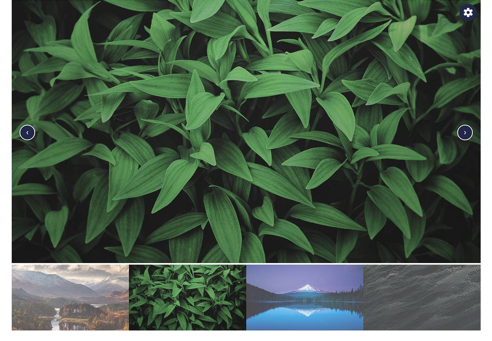
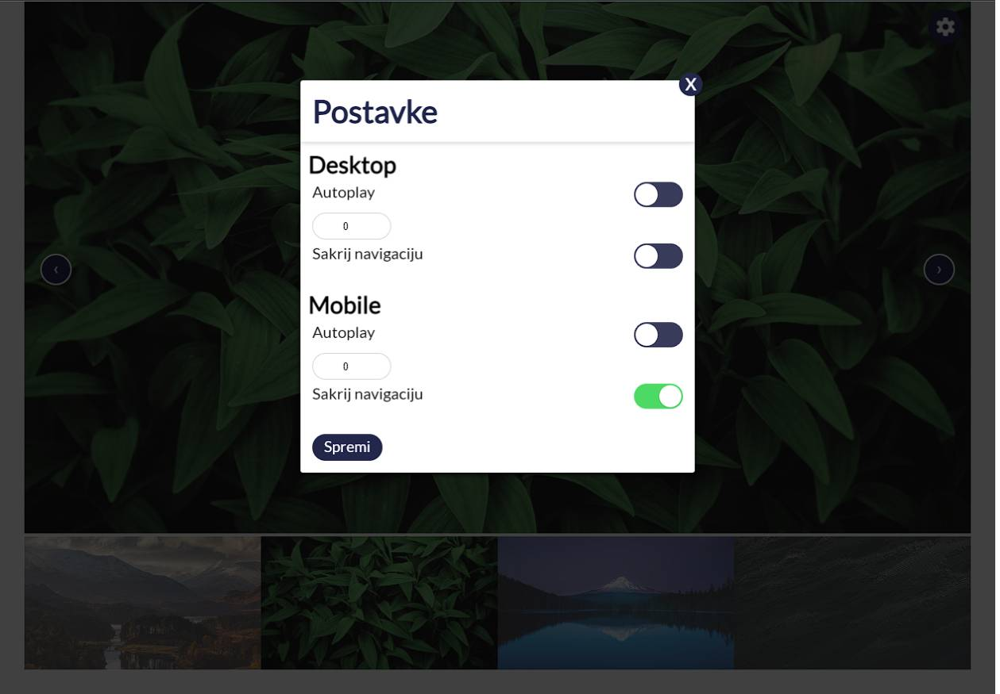

<h1>Zadatak 2 - Carousel</h1>
 
 

## Info

* simple carousel with mobile and desktop config
* JQuery + Sass
* Compile css on file save

## How to run?

* simply open index.html (recompile css based on code changes)
